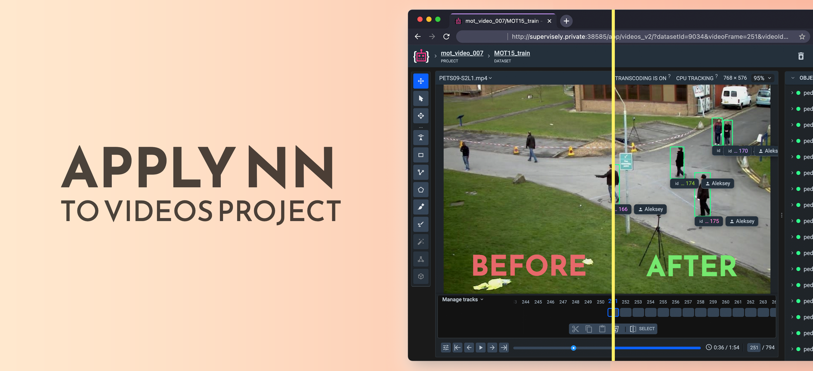
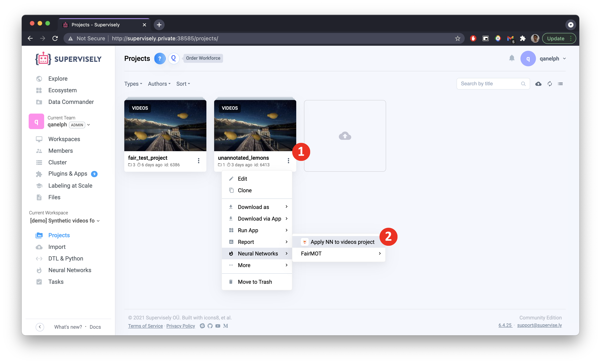

  

# Apply NN to Videos Project

  <a href="#Overview">Overview</a> •
  <a href="#Demo">Demo</a> •
  <a href="#Related-Apps">Related Apps</a> •
  <a href="#How-To-Run">How To Run</a> •
    <a href="#Screenshot">Screenshot</a>

# Overview

Application allows you to apply a served neural network to a video.

Application key points:  
- Connects to Served models in Supervisely
- Supports Object Detection Models
- Supports Instance Segmentation Models
- Supports Semantic Segmentation Models
- Applies Deep Sort (tracking algorithm) to model Predictions 
- Creates a new project with Labeled Videos

# Demo

# Related Apps

Application supports next models: 

### Object Detection:  
  - [Serve YOLOv5](https://ecosystem.supervise.ly/apps/supervisely-ecosystem/yolov5/supervisely/serve)  
       
  - [Serve MMDetection](https://ecosystem.supervise.ly/apps/supervisely-ecosystem/mmdetection/serve)  
    
    
### Instance Segmentation:  
  
- [Serve Detectron2](https://ecosystem.supervise.ly/apps/supervisely-ecosystem/detectron2/supervisely/instance_segmentation/serve)  
      
- [Serve MMDetection](https://ecosystem.supervise.ly/apps/supervisely-ecosystem/mmdetection/serve)    
      

### Semantic Segmentation:  

- [Serve UNet](https://ecosystem.supervise.ly/apps/supervisely-ecosystem/unet/supervisely/serve)  
       
- [Serve MMSegmentation](https://ecosystem.supervise.ly/apps/supervisely-ecosystem/mmsegmentation/serve)  
     
      

# How to Run

1. Launch Serve APP, designed for Videos Projects

  

2. Add [Apply NN to videos project](https://ecosystem.supervise.ly/apps/apply-nn-to-videos-project) from ecosystem to your team  

3. Run app from the context menu of **Videos Project**:  

  

4. Set the settings and apply NN to Videos Project

# Screenshot

